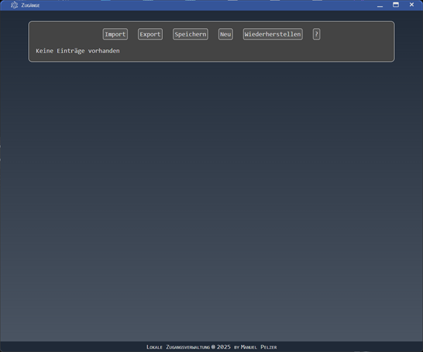

\# 🔑 Passwort-Manager App


!\[Version](https://img.shields.io/badge/version-1.0-blue.svg)

!\[License](https://img.shields.io/badge/license-MIT-green.svg)

!\[Status](https://img.shields.io/badge/status-stable-success.svg)


A minimalist password manager that unlocks its features only after entering a \*\*master password\*\*.

The app stores your entries encrypted and allows for export/import and easy management.

The app is based on Electron and uses JSFuck in its renderer.

---


\## 🚀 Installation


Clone the repository and install the dependencies:

```bash

git clone https://github.com/ManuelPeh76/Zugangsverwaltung.git


cd Zugangsverwaltung


npm install

```


\## 🎬 Start the app


```bash

npm start

```


\## 🔐 Master Password

\- Default: secret


\- Input is invisible (no display during input).


\- Once entered successfully, the options appear and remain visible until the app loses focus.


\#### Change Master Password

\- CTRL + N → Start password change mode


\- Enter new password (invisible)


\- Enter → Apply


\- Escape → Cancel


\#### ⚠️ Important:

\- The master password is not stored in a file.


\- If you forget, all your entries will be lost.


\- In the app it is only cached in base64 encoding.


\## 💾 Storage of entries

\- All data is located in src/data.js.


\- Stored as an encrypted array.


\- Passwords \& registration keys additionally base64 encoded.


\## ⌨️ Keyboard shortcut (logged in)

|Key|Function|

|---|---|

|⬆️ ⬇️|Go to previous/next entry|

|⬅️ ➡️|Expand/collapse details|

|Spacebar|Show password in the current entry|

|Escape|Cancel add or edit entry|

|Ctrl + N|Enter master password change mode|

|Escape (change mode)|Cancel|

|Backspace (change mode)|Delete last character|

|Enter (change mode)|Apply new password|


\## 🖥️ Menu \& Functions

\#### Header Bar

\- Import → Import data from a JSON file (overwrites existing data)


\- Export → Export data to a JSON file


\- Save → Save changes to data.js


\- New → Add a new entry


\- Restore → View and restore/delete removed entries


\- ? → View help


\#### Further controls:

\- Click on an entry name to show or hide details.

\- As you type letters, the app automatically jumps to the first matching entry.


\## 📸 Screenshots

|--:|:--|

|\*\*Home view\*\*||

|\*\*After entering the master password\*\*||

|\*\*Overview with entries, one of them open\*\*||


\## ⚙️ Build

To use the app as a standalone app, it must be packaged.

```bash

npm run build

```

does this. The app will then be located in the ./dist folder.


\## 📦 Installer

On Windows, you can create an installer that will install the app automatically in <br>`C:\\Users\\<username>\\AppData\\Local\\access\_management`.

```bash

npm run build


npm run setup

```

The created installation files (.exe and .msi, you choose) can also be found in the dist folder, under /installers.


\## JSFuck

JSFuck is a tool that can represent any text (or numbers, special characters, etc.) with these six characters: \[]+()!.<br>

In such a way that, in the case of JavaScript source code, the JavaScript engine processes the characters normally, as if it were normal source code. It's just that it's no longer readable.<br>

I realize that JSFuck isn't a panacea for encrypting source code. However, no layperson will be able to make it readable again. Anyone familiar with the subject matter will certainly not be deterred by this (where there's a will, there's a way).<br>

In any case, I wanted to leave no stone unturned to shield the password encryption and the "critical" functionality from the outside world, as far as my limited resources allow (I am by no means an encryption expert).<br>

So much for my reasons for using JSFuck. Nevertheless, I put the original source code into the file renderer.orig.js. You should delete it before packaging the app, since it is not needed anyway.


\## 📜 License

This project is licensed under the MIT License.

