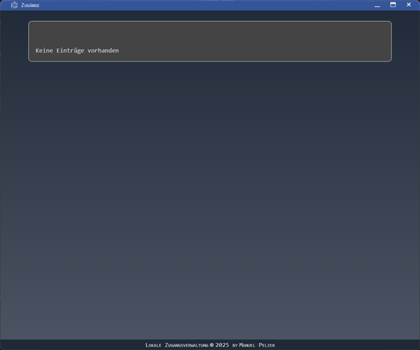
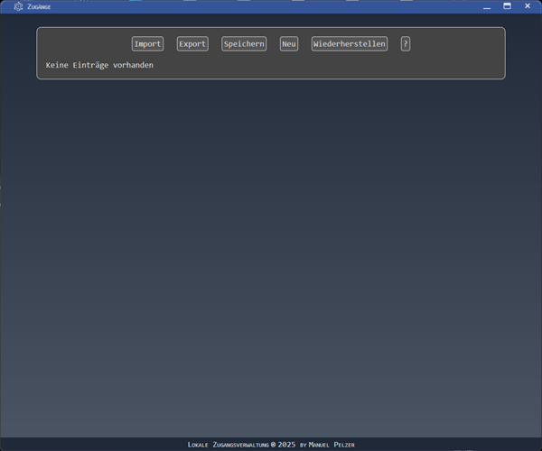
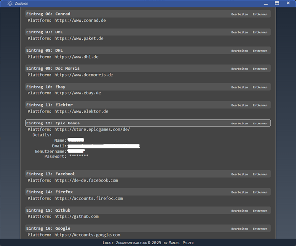

# 🔑 Passwort-Manager App


Ein minimalistischer Passwort-Manager, der seine Funktionen erst nach Eingabe eines **Master-Passworts** freischaltet.  
Die App speichert deine Einträge verschlüsselt und ermöglicht Export/Import sowie eine einfache Verwaltung.
Die App basiert auf Electron und verwendet JSFuck im Renderer.

---

## 🚀 Installation

Repository klonen oder ZIP herunterladen

```bash
git clone https://github.com/ManuelPeh76/zugangsverwaltung.git

cd zugangsverwaltung

npm install
```

## 🎬 App starten

```bash
npm start
```

## 🔐 Master-Passwort
- Standard: secret

- Eingabe erfolgt unsichtbar (keine Anzeige während der Eingabe).

- Nach erfolgreicher Eingabe bleiben die Optionen sichtbar, bis die App den Fokus verliert.

#### Master-Passwort ändern
- Strg + N → Änderungsmodus starten

- Neues Passwort eingeben (unsichtbar)

- Enter → übernehmen

- Escape → abbrechen

#### ⚠️ Wichtig:
- Das Master-Passwort wird nicht in einer Datei gespeichert.

- Wenn du es vergisst, sind alle deine Einträge verloren.

- In der App wird es nur base64-kodiert zwischengespeichert.


## 💾 Speicherung der Einträge
- Alle Daten liegen in src/data.js.

- Gespeichert als verschlüsseltes Array.

- Passwörter & Registrierungs-Keys zusätzlich base64-kodiert.

## ⌨️ Tastenkürzel (eingeloggt)
|Tastenkombination|Funktion|
|---|---|
|⬆️ / ⬇️ Pfeiltasten|Zum vorherigen/nächsten Eintrag wechseln|
|⬅️ / ➡️ Pfeiltasten|Details ein-/ausklappen|
|Leertaste|Alle Passwörter im aktuellen Eintrag anzeigen|
|Escape|Bearbeiten / Neu abbrechen|
|Strg + N|Master-Passwort ändern|
|Escape (Änderungsmodus)|Abbrechen|
|Backspace (Änderungsmodus)|Letztes Zeichen löschen|
|Enter (Änderungsmodus)|Neues Passwort übernehmen|

## 🖥️ Menü & Funktionen
#### Headerleiste
- Import → Daten aus JSON-Datei importieren (überschreibt bestehende Daten)

- Export → Daten in JSON-Datei exportieren

- Speichern → Änderungen dauerhaft sichern

- Neu → Neuen Eintrag hinzufügen

- Wiederherstellen → Entfernte Einträge anzeigen und wiederherstellen/löschen

- ? → Hilfe anzeigen

#### Weitere Bedienung:
- Klicke auf einen Eintragsnamen, um Details ein- oder auszublenden.
- Beim Eintippen von Buchstaben springt die App automatisch zum ersten passenden Eintrag.

## 📸 Screenshots

|**Startansicht**||
|--:|:--|
|**Nach Eingabe des Master-Passworts**||
|**Übersicht mit Einträgen, einer davon geöffnet**||


## ⚙️ Build
Um die App als Standalone-App zu benutzen, muss sie gepackt werden.
```bash
npm run build
```
erledigt das. Danach befindet sich die App im Ordner zugangsverwaltung/dist.

## 📦 Installer
Unter Windows kannst du einen Installer erstellen lassen, mit dem die App ohne weitere Angaben nach Doppelklick unter<br>`C:\Users\<Benutzername>\AppData\Local\zugangsverwaltung` installiert wird.
```bash
npm run build

npm run setup
```
Die erstellten Installationsdateien (.exe und .msi, du hast die Wahl) findest du ebenfalls im dist-Ordner, unter /installers.

## JSFuck
JSFuck ist ein Tool, das jeglichen Text (oder auch Zahlen, Sonderzeichen etc.) mit diesen sechs Zeichen darstellen kann: []+()!.<br>
Und zwar so, dass, im Falle von Javascript-Quellcode, der Javascript-Interpreter (oder ist es ein Parser?) die Zeichen ganz normal verarbeitet, als handelte es sich um ganz normalen Quellcode. Nur lesbar ist er jetzt nicht mehr.<br>
Mir ist klar, dass JSFuck kein Allheilmittel ist, um den Quellcode zu verschlüsseln. Dennoch wird kein Laie in der Lage sein, ihn wieder lesbar zu machen. Wer sich mit der Materie auskennt, lässt sich davon sicherlich nicht abschrecken (wo ein Wille, da ein Weg).<br>
Ich wollte jedenfalls nichts unversucht lassen, die Verschlüsselung der Passwörter sowie die "kritische" Funktionalität, soweit es meine bescheidenen Möglichkeiten zulassen, von der Außenwelt abzuschotten.<br>
Soweit meine Beweggründe zur Verwendung von JSFuck.

## 📜 Lizenz
Dieses Projekt steht unter der MIT Lizenz.
